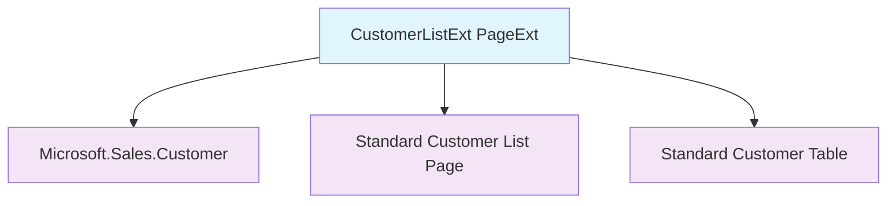
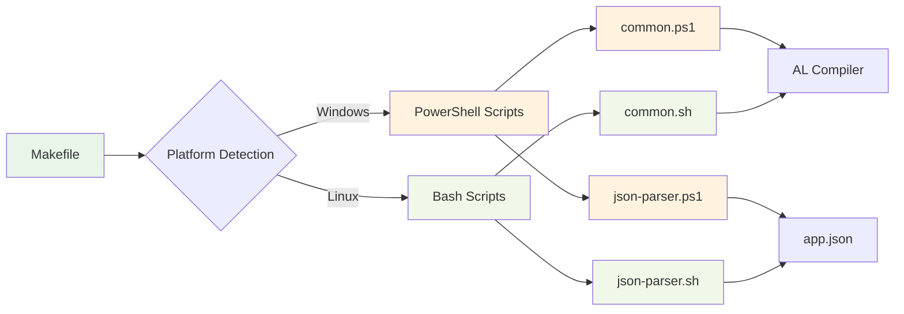

# Architectural Analysis

## High-Level Architecture

### Overall Architectural Style
ALMakeDemo exhibits a **minimal monolithic extension** architecture with a strong focus on **build system infrastructure**. The AL extension itself is deliberately simple, serving as a vehicle to demonstrate build automation rather than complex business logic.

**Architectural Characteristics:**
- **Minimal Business Logic**: Single page extension with basic field addition
- **Infrastructure-Heavy**: Sophisticated build automation system
- **Educational Design**: Prioritizes clarity and learning over complex functionality
- **Cross-Platform Oriented**: Architecture designed for multiple development environments

### Logical Module Identification

Given the project's educational focus, the architecture can be viewed as having two primary domains:

#### 1. AL Extension Module
**Purpose**: Demonstrates basic AL development patterns
**Key Components:**
- `CustomerListExt.PageExt.al` - Customer List page extension

**Characteristics:**
- Single responsibility: Add Balance Due field to Customer List
- No complex business logic
- Minimal dependencies (only uses standard Customer table)

#### 2. Build Automation Module
**Purpose**: Provides cross-platform build system infrastructure
**Key Components:**
- `Makefile` - Unified build system entry point
- `scripts/make/windows/` - Windows PowerShell build scripts
- `scripts/make/linux/` - Linux Bash build scripts
- Shared libraries for common operations

**Characteristics:**
- Platform abstraction layer
- Modular script organization
- Automated AL compiler and analyzer discovery
- Robust error handling and validation

## Component Interaction and Dependencies

### AL Extension Dependencies


**Dependency Analysis:**
- **Minimal External Dependencies**: Only depends on standard Business Central objects
- **Using Statement**: Explicitly imports `Microsoft.Sales.Customer` namespace
- **Extension Pattern**: Extends existing functionality without modifying core objects
- **Loose Coupling**: No hard dependencies on other custom objects

### Build System Architecture


**Build System Interactions:**
- **Platform Abstraction**: Makefile provides unified interface regardless of OS
- **Script Delegation**: Platform-specific scripts handle implementation details
- **Shared Logic**: Common libraries prevent code duplication
- **External Tool Integration**: Scripts interact with AL compiler and VS Code extension

## Key Design Patterns (Inferred)

### 1. Extension Pattern (AL Domain)
**Implementation**: Page Extension for Customer List
```al
pageextension 50100 CustomerListExt extends "Customer List"
```

**Benefits:**
- Non-intrusive modification of existing functionality
- Maintains upgrade compatibility
- Follows Business Central best practices
- Enables feature addition without core system changes

### 2. Template Method Pattern (Build System)
**Implementation**: Makefile defines algorithm structure, platform scripts provide specific implementations

**Structure:**
- Makefile: Defines build workflow (detect platform → delegate → execute)
- Platform Scripts: Implement specific steps for their environment
- Shared Libraries: Provide common operations used by all implementations

### 3. Strategy Pattern (Build System)
**Implementation**: Different build strategies for Windows vs Linux
- **Windows Strategy**: PowerShell-based implementation with Windows-specific paths
- **Linux Strategy**: Bash-based implementation with Unix-style operations
- **Common Interface**: Both strategies implement same operations (build, clean, show-config)

### 4. Facade Pattern (Build System)
**Implementation**: Makefile provides simplified interface to complex build operations
- **Complex Subsystem**: Platform detection, script execution, path resolution, error handling
- **Simple Interface**: `make build`, `make clean`, `make show-config`
- **Abstraction**: Users don't need to understand platform-specific implementation details

### 5. Library Pattern (Build System)
**Implementation**: Shared libraries encapsulate common functionality
- **common.ps1/sh**: File operations, path utilities, error handling
- **json-parser.ps1/sh**: Configuration file parsing and validation
- **Reusability**: Functions used across multiple scripts

## Potential Architectural Concerns / Anti-Patterns

### Current Architecture Strengths
✅ **Clean Separation of Concerns**: AL extension and build system are logically separated
✅ **Platform Abstraction**: Build system handles cross-platform differences elegantly
✅ **Minimal Dependencies**: AL extension has no unnecessary dependencies
✅ **Educational Clarity**: Architecture prioritizes understandability

### Potential Areas for Consideration (If Extended)

#### 1. Limited AL Architecture Patterns
**Current State**: Only demonstrates page extension pattern
**Potential Enhancement**: Could showcase additional patterns like:
- Event-driven architecture (event publishers/subscribers)
- Codeunit-based business logic separation
- Interface implementations for extensibility
- Table extension patterns

#### 2. No Error Handling in AL Code
**Current State**: Simple Message() call without error handling
**Consideration**: Real-world extensions would include:
- Try-catch patterns
- User confirmation dialogs
- Data validation logic
- Graceful error recovery

#### 3. Build System Complexity vs. AL Simplicity
**Current State**: Sophisticated build system supporting minimal AL code
**Analysis**: This is intentional for educational purposes, but represents an imbalance
**Benefits**: Demonstrates proper infrastructure setup for larger projects

#### 4. No Testing Architecture
**Current State**: No test frameworks or test objects
**Consideration**: Production extensions would include:
- Test codeunits
- Test isolation patterns
- Automated test execution in build pipeline

## Architectural Evolution Recommendations

### For Educational Enhancement
1. **Add Business Logic Codeunit**: Demonstrate separation of concerns
2. **Implement Event Pattern**: Show publisher/subscriber architecture
3. **Add Data Validation**: Demonstrate error handling patterns
4. **Include Test Objects**: Show testing architecture patterns

### For Production Extension
1. **Add Proper Error Handling**: Implement robust error management
2. **Implement Security Checks**: Add permission validation
3. **Add Configuration Management**: Implement setup tables and configuration UI
4. **Include Telemetry**: Add usage tracking and monitoring

## Summary

ALMakeDemo demonstrates **excellent architectural principles** for its intended purpose:

**AL Extension Architecture:**
- Clean, minimal design focusing on educational value
- Proper use of extension patterns
- Good adherence to AL architectural best practices
- Room for expansion to demonstrate additional patterns

**Build System Architecture:**
- Sophisticated and well-designed cross-platform system
- Excellent use of design patterns (Strategy, Facade, Template Method)
- Modular, maintainable, and extensible structure
- Production-ready approach that could support much larger projects

The architecture successfully balances **simplicity for learning** with **infrastructure sophistication**, making it an excellent foundation for both educational purposes and potential expansion into more complex AL development scenarios.

---

**Navigation:**
- [← Previous: Codebase Structure](02_codebase_structure.md)
- [Next: Data Model Analysis →](04_data_model.md)
- [Back to Index ↑](index.md)
