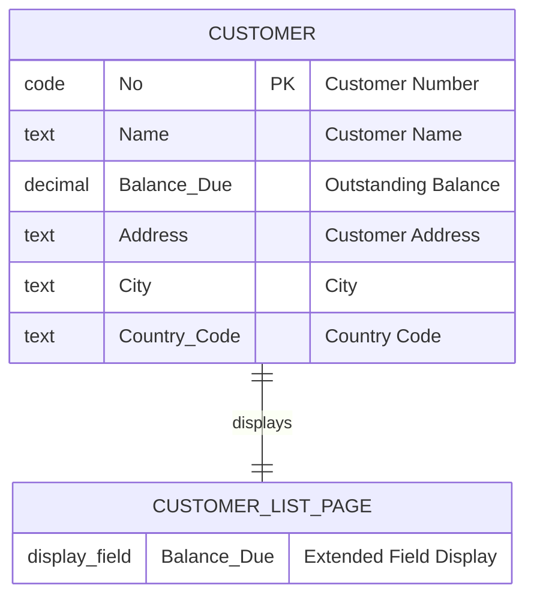
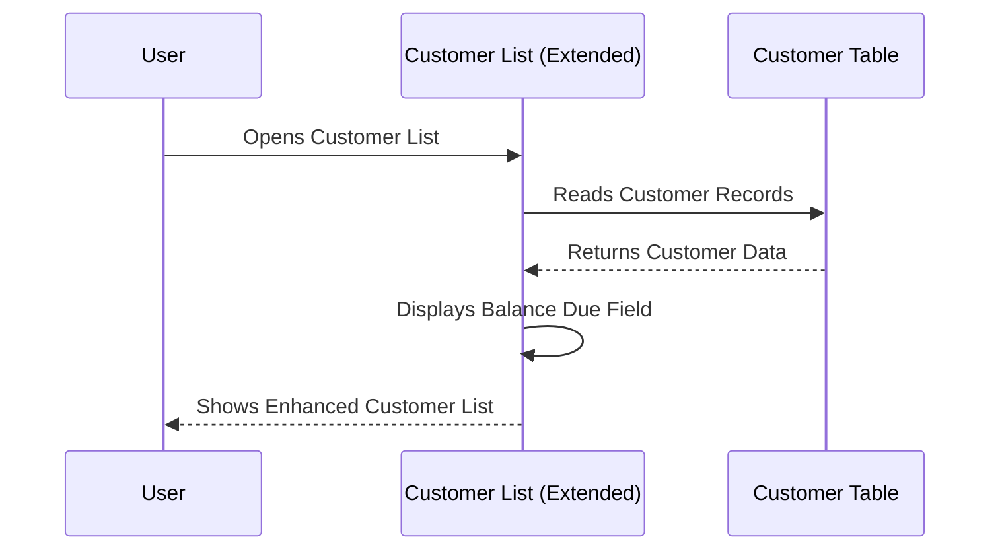

# Data Model Analysis

## Core Entities and Relationships

### Custom Tables
**ALMakeDemo contains no custom tables.** The extension operates entirely on existing Business Central standard objects, which is a common pattern for simple extensions that enhance existing functionality without introducing new data structures.

### Extended Standard Tables
The extension interacts with the following standard Business Central tables:

#### 1. Customer Table (Table 18)
**Extension Type**: Read-only field access
**Interaction**: The page extension displays the "Balance Due" field from the Customer table

| Field Name | Data Type | Purpose | Usage in Extension |
|------------|-----------|---------|-------------------|
| "Balance Due" | Decimal | Outstanding customer balance | Displayed in Customer List page |

**Primary Key**: "No." (Customer Number)
**Relationship Context**: The Customer table is the primary data source for the Customer List page being extended.

## Entity-Relationship Diagram

Since ALMakeDemo doesn't introduce custom tables, the data model is minimal and focused on existing Business Central relationships:



**Diagram Notes:**
- **CUSTOMER**: Standard Business Central Customer table (Table 18)
- **CUSTOMER_LIST_PAGE**: Represents the UI extension, not a data table
- **Relationship**: The page extension displays data from the Customer table
- **Extension Field**: "Balance Due" field is exposed through the page extension

## Standard Table Extensions
The project demonstrates a **non-intrusive extension pattern** where:
- No custom fields are added to existing tables
- No custom tables are created
- Extension only modifies the presentation layer (page)
- Data integrity of standard Business Central objects is preserved

## Key Enums and Option Fields

### Current Project
ALMakeDemo does not define any custom enums or option fields. The extension uses only:
- Standard Business Central field types
- Standard ApplicationArea enumeration (`All`)

### Standard Business Central References
The extension references standard enums implicitly:
- **ApplicationArea**: Uses `All` value to make field visible in all application areas

## Data Validation Logic

### Current Implementation
The extension implements **no custom data validation logic**. This follows the principle of minimal extension where:
- Data validation remains with the source table (Customer table)
- Extension only provides additional field visibility
- No business rules are modified or added

### Standard Business Central Validation
The "Balance Due" field relies on standard Customer table validation:
- **Source Table Triggers**: Customer table handles all data validation
- **Field Validation**: Controlled by standard Business Central logic
- **Data Consistency**: Maintained through standard table relationships

## Data Access Patterns

### Read-Only Field Access
```al
field(BalanceDue; Rec."Balance Due")
{
    ApplicationArea = All;
    Caption = 'Balance Due';
    ToolTip = 'Shows the outstanding balance amount for the customer';
}
```

**Analysis:**
- **Access Type**: Read-only display of existing field
- **Data Source**: `Rec."Balance Due"` references the current Customer record
- **No Data Modification**: Extension doesn't alter data, only displays it
- **Standard AL Pattern**: Uses recommended `Rec.` reference pattern

### Standard Business Central Data Flow


## Data Security Considerations

### Permission Requirements
The extension inherits permission requirements from the standard Customer List page:
- **Table Permissions**: Requires read access to Customer table (Table 18)
- **Page Permissions**: Requires access to Customer List page
- **ApplicationArea**: Set to `All` for maximum accessibility in demo context

### Security Pattern Analysis
- **No Additional Security Risk**: Extension doesn't expose new data or modify existing security
- **Standard Permissions Apply**: All existing Business Central security rules remain intact
- **Read-Only Access**: Minimizes security concerns by not allowing data modification

## Data Performance Considerations

### Performance Impact Assessment
The extension has **minimal performance impact**:

**Positive Aspects:**
- ✅ **No Additional Database Queries**: Uses existing page data loading
- ✅ **Standard Field Access**: "Balance Due" is already loaded with Customer records
- ✅ **No Complex Calculations**: Simple field display without computation
- ✅ **No Additional Table Joins**: Works with existing Customer List data set

**Potential Considerations:**
- **Field Display Overhead**: Minimal additional rendering for one field
- **UI Responsiveness**: Negligible impact on page loading performance

### Data Loading Strategy
```al
// The extension leverages the existing Customer List page data loading strategy
// No custom SETCURRENTKEY, filters, or optimization needed
```

The extension benefits from:
- Standard Customer List SIFT keys and optimization
- Existing filtering and sorting capabilities
- Standard Business Central caching mechanisms

## Extensibility and Future Data Model Considerations

### Current Extensibility
The minimal data model provides excellent extensibility opportunities:

**Easy Extensions:**
- Additional Customer field displays
- Related table field lookups (e.g., Customer statistics)
- Calculated fields based on existing Customer data

**Architecture Support:**
- Clean separation allows adding custom tables without conflicts
- Page extension pattern supports additional field additions
- No data dependencies that would complicate future enhancements

### Recommended Patterns for Growth
If the extension were to be expanded, recommended data model patterns include:

1. **Setup Tables**: For configuration and customization options
2. **Log Tables**: For tracking user interactions or system events
3. **Temporary Tables**: For complex calculations or data transformations
4. **Interface Tables**: For integrations with external systems

## Summary

ALMakeDemo demonstrates an **exemplary minimal data model approach** that:

**Strengths:**
- ✅ **Non-Intrusive**: Doesn't modify existing Business Central data structures
- ✅ **Performance Friendly**: Leverages existing data loading patterns
- ✅ **Security Compliant**: Maintains all standard Business Central security patterns
- ✅ **Upgrade Safe**: No custom data dependencies that could cause upgrade issues
- ✅ **Extensible**: Provides clean foundation for future data model expansion

**Educational Value:**
- Demonstrates proper extension patterns without data model complexity
- Shows how to enhance UI without modifying underlying data structures
- Provides foundation for understanding more complex data model patterns

**Production Readiness:**
- The data access patterns used are production-ready
- Security and performance considerations are properly addressed
- Extension follows Business Central best practices for data model interaction

This minimal yet well-structured approach makes ALMakeDemo an excellent starting point for developers learning Business Central data model interaction patterns.

---

**Navigation:**
- [← Previous: Architecture Analysis](03_architecture.md)
- [Next: Key Functionalities and Business Logic Flows →](05_key_flows.md)
- [Back to Index ↑](index.md)
