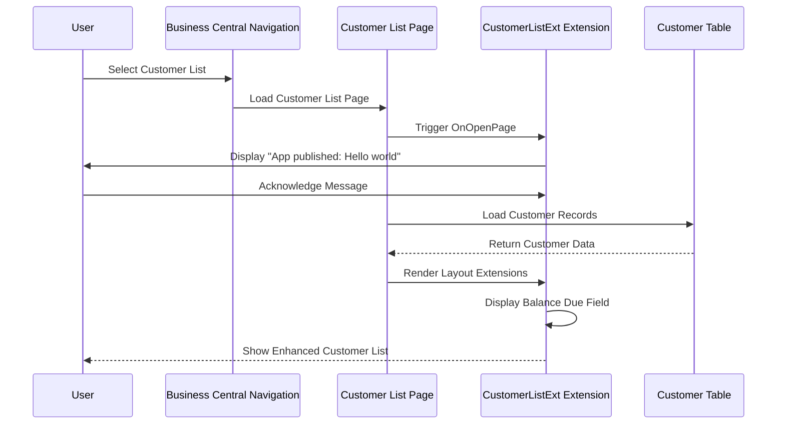
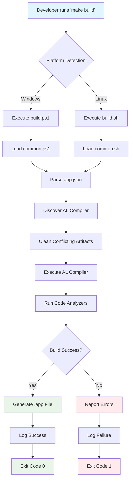

# Key Functionalities and Business Logic Flows

## Identification of Core Processes

ALMakeDemo implements **two primary functional areas**:

### 1. AL Extension Functionality
**Process Name**: Customer List Enhancement with Balance Due Display
**Business Purpose**: Provide users with immediate visibility of customer outstanding balances directly on the Customer List page

### 2. Build System Automation
**Process Name**: Cross-Platform AL Build Automation
**Business Purpose**: Enable consistent, automated compilation and validation of AL extensions across Windows and Linux development environments

## Detailed Flow Analysis

### Flow 1: Customer List Balance Due Display

#### Entry Points
- **Primary Entry Point**: User navigating to Customer List page (Page 22)
- **Trigger**: Page load and record display events
- **User Action**: Opening Customer List from Role Center or navigation menu

#### Sequence of Operations

**Step-by-Step Execution:**
1. **User Navigation**: User selects Customer List from Business Central navigation
2. **Page Load**: Standard Customer List page begins loading
3. **Extension Activation**: CustomerListExt page extension is triggered
4. **OnOpenPage Trigger**: Extension's OnOpenPage trigger executes
5. **Welcome Message**: System displays "App published: Hello world" message
6. **Layout Extension**: Additional Balance Due field is rendered in the page layout
7. **Data Binding**: Balance Due field displays data from Customer."Balance Due" field
8. **Page Display**: Enhanced Customer List is presented to user

#### Data Transformations
- **No Data Modification**: Extension only reads and displays existing data
- **Field Mapping**: `Rec."Balance Due"` → Display field "Balance Due"
- **UI Enhancement**: Adds visual field to existing Customer List layout

#### Decision Points
- **No Complex Logic**: Extension follows linear execution path
- **Standard Business Central Logic**: All business rules handled by underlying Customer table and page

#### User Interaction
1. **Page Access**: User opens Customer List (requires appropriate permissions)
2. **Message Acknowledgment**: User dismisses welcome message dialog
3. **Data Viewing**: User can view Balance Due information alongside other customer data
4. **Standard Operations**: All standard Customer List operations remain available

#### Flow Diagram


### Flow 2: Cross-Platform Build Process

#### Entry Points
- **Primary Entry Point**: Developer executes `make build` command
- **Alternative Entry Points**: `make clean`, `make show-config`, `make show-analyzers`
- **Trigger**: Command-line interface interaction

#### Sequence of Operations

**Build Process Steps:**
1. **Command Execution**: Developer runs `make build` in project directory
2. **Platform Detection**: Makefile detects Windows or Linux environment
3. **Script Delegation**: Makefile calls appropriate platform script
4. **Common Library Loading**: Platform script imports shared functions
5. **Configuration Parsing**: Script reads app.json and .vscode/settings.json
6. **AL Compiler Discovery**: Script locates AL compiler and analyzer DLLs
7. **Artifact Cleanup**: Script removes conflicting files/directories
8. **Compilation Execution**: AL compiler is invoked with proper parameters
9. **Analysis Execution**: Code analyzers (CodeCop, UICop) validate the code
10. **Output Generation**: Compiled .app file is created
11. **Build Logging**: Results are written to build.log
12. **Success/Failure Report**: Build status is reported to developer

#### Data Transformations
- **Configuration Reading**: JSON parsing of app.json → build parameters
- **Path Resolution**: Relative paths → absolute paths for compiler
- **Artifact Naming**: App metadata → output filename (Publisher_Name_Version.app)

#### Decision Points
1. **Platform Detection**: Windows vs Linux determines script path
2. **Compiler Discovery**: Script searches for AL compiler in VS Code extensions
3. **Artifact Conflicts**: Script checks for existing files that need cleanup
4. **Build Success/Failure**: Determines exit codes and logging

#### User Interaction
1. **Command Input**: Developer types `make build` command
2. **Progress Monitoring**: Developer observes build output and logging
3. **Error Resolution**: If build fails, developer reviews errors and makes corrections
4. **Artifact Usage**: Developer can use generated .app file for deployment

#### Flow Diagram


## Integration Flows

### AL Extension Integration with Business Central
```mermaid
activityDiagram
    start
    :User opens Business Central;
    :Navigate to Customer List;
    :Page loads with extension;
    if (Extension installed?) then (yes)
        :Display welcome message;
        :Show enhanced layout with Balance Due field;
        :Display customer data with balance information;
    else (no)
        :Show standard Customer List;
    endif
    :User interacts with customer data;
    stop
```

### Build System Integration with Development Environment
```mermaid
activityDiagram
    start
    :Developer modifies AL code;
    :Run make build command;
    :Platform detection;
    :Load configuration files;
    :Validate AL syntax;
    if (Code valid?) then (yes)
        :Compile extension;
        :Run code analyzers;
        if (Analysis passes?) then (yes)
            :Generate .app file;
            :Log success;
        else (no)
            :Report analysis errors;
            :Log failure;
        endif
    else (no)
        :Report compilation errors;
        :Log failure;
    endif
    stop
```

## Performance and Error Handling Considerations

### Customer List Enhancement Performance
- **Load Time Impact**: Minimal - adds one field display
- **Memory Usage**: Negligible - no additional data queries
- **UI Responsiveness**: No measurable impact on page performance

### Build System Performance
- **Script Execution**: Typically completes in 10-30 seconds depending on project size
- **Caching**: Leverages AL compiler caching for incremental builds
- **Resource Usage**: Moderate during compilation, minimal during idle

### Error Handling Patterns

#### AL Extension Error Handling
```al
trigger OnOpenPage();
begin
    Message('App published: Hello world');
end;
```
**Current State**: Basic message display without error handling
**Production Considerations**: Real extensions would include try-catch patterns and validation

#### Build System Error Handling
The build scripts implement robust error handling:
- **Configuration Validation**: Checks for required files and settings
- **Compiler Discovery**: Validates AL compiler availability
- **Exit Codes**: Proper success/failure reporting
- **Logging**: Comprehensive error reporting to build.log

## Extensibility and Enhancement Opportunities

### AL Extension Enhancement Possibilities
1. **Advanced Customer Information**: Add more calculated fields or lookups
2. **User Preferences**: Allow users to configure which fields to display
3. **Data Validation**: Add custom validation logic for customer data
4. **Integration Points**: Connect to external systems for enhanced data

### Build System Enhancement Possibilities
1. **Test Automation**: Integrate automated testing into build pipeline
2. **Deployment Automation**: Add deployment scripts for various environments
3. **Code Quality Gates**: Add additional analyzers and quality checks
4. **Continuous Integration**: Integrate with CI/CD systems

## Summary

ALMakeDemo demonstrates **fundamental AL development flows** that serve as excellent learning foundations:

**AL Extension Flows:**
- ✅ **Simple and Clear**: Easy to understand page extension pattern
- ✅ **Standard Patterns**: Uses recommended Business Central extension techniques
- ✅ **Non-Intrusive**: Enhances without disrupting existing functionality
- ✅ **Educational Value**: Perfect for learning basic AL development concepts

**Build Automation Flows:**
- ✅ **Production-Ready**: Sophisticated automation suitable for real projects
- ✅ **Cross-Platform**: Demonstrates proper abstraction for multiple environments
- ✅ **Modular Design**: Easy to extend and customize for specific needs
- ✅ **Best Practices**: Implements proper error handling and validation

The flows documented here provide a solid foundation for understanding both **simple AL development patterns** and **professional build automation practices**, making ALMakeDemo valuable for developers at various experience levels.

---

**Navigation:**
- [← Previous: Data Model Analysis](04_data_model.md)
- [Next: Eventing Model and Extensibility →](06_eventing_extensibility.md)
- [Back to Index ↑](index.md)
