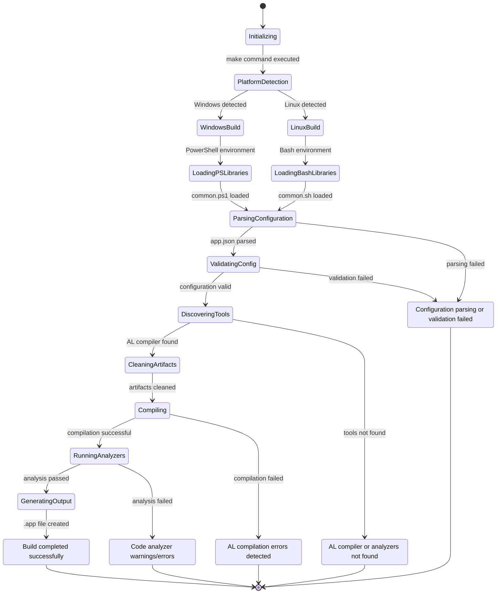
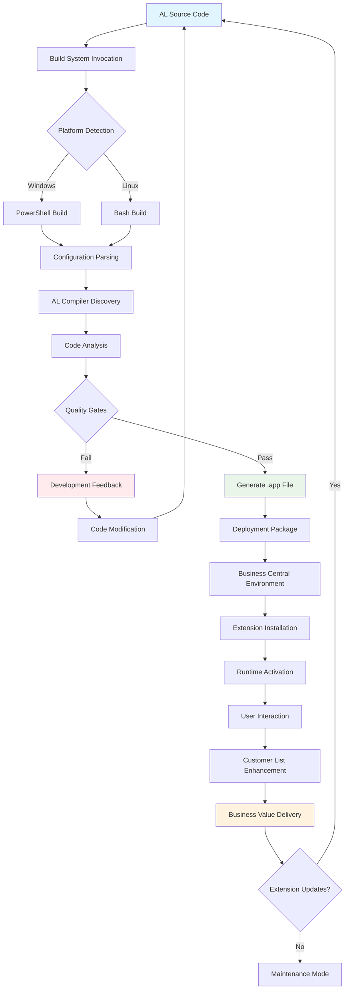
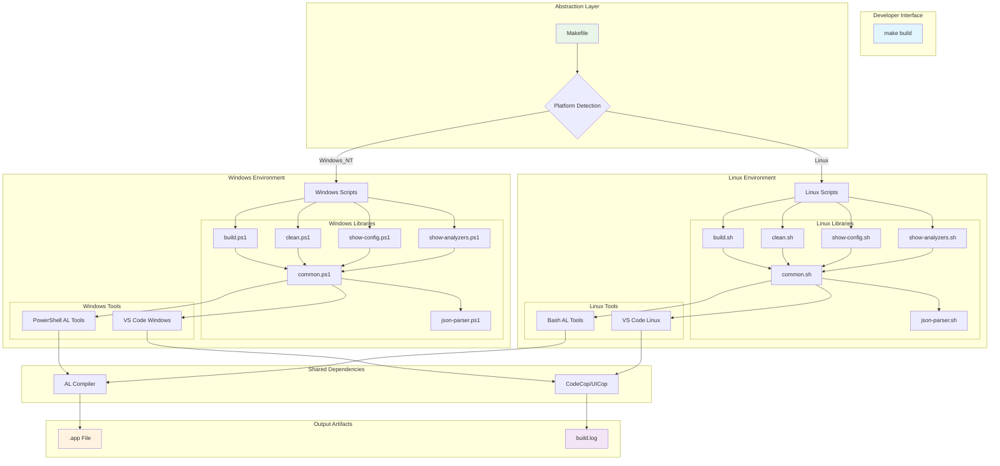
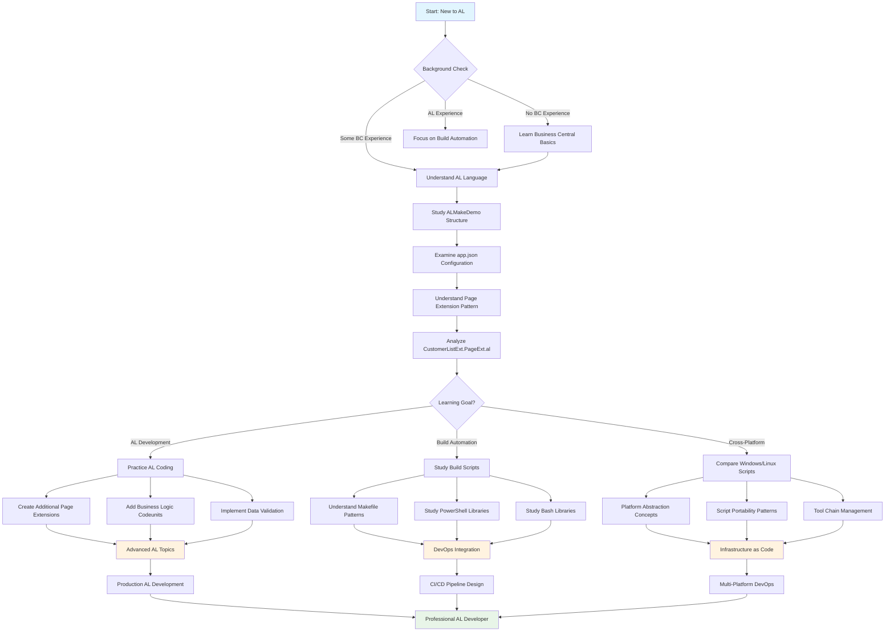
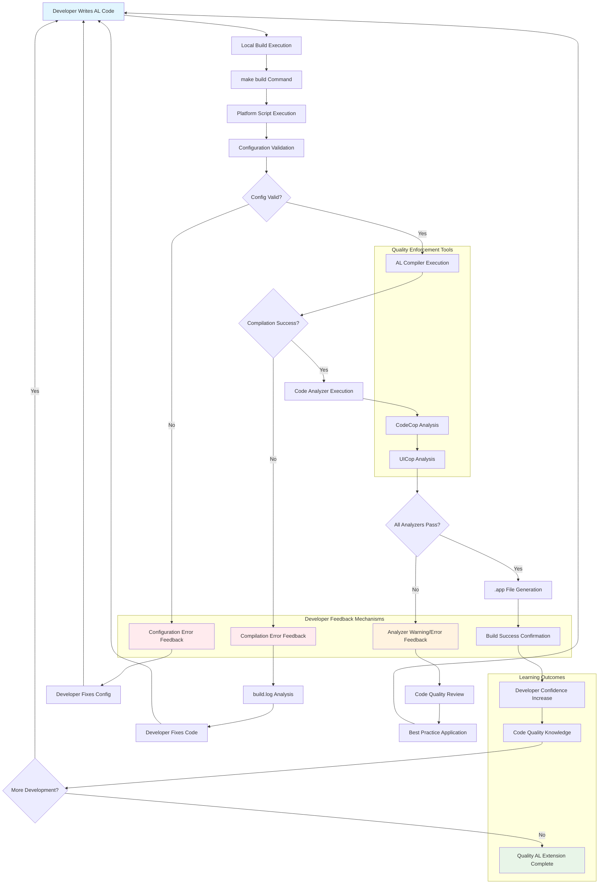

# Suggested Diagrams

Based on the comprehensive analysis of ALMakeDemo, here are additional diagram types that would be particularly valuable for understanding this specific codebase beyond the ERD and Flow Diagrams already provided.

## 1. Build System State Diagram

### Diagram Type: State Diagram
### Rationale
ALMakeDemo's sophisticated build automation system has multiple states and transitions that would benefit from state-based visualization. The build process involves platform detection, tool discovery, compilation states, and error handling states that form a complex state machine. Understanding these states is crucial for developers troubleshooting build issues or extending the build system.

### Value for This Project
A state diagram would specifically help developers understand:
- How the build system transitions between different operational states
- What triggers each state transition (platform detection, file presence, error conditions)
- Recovery paths when builds fail
- The relationship between cross-platform build states

### Mermaid Implementation

## 2. Extension Lifecycle Diagram

### Diagram Type: Activity/Lifecycle Diagram
### Rationale
While ALMakeDemo is a simple extension, it participates in the Business Central extension lifecycle in ways that are educationally valuable. Understanding how the extension moves through development, compilation, deployment, and runtime phases would help developers understand the broader context of AL development workflows.

### Value for This Project
This diagram would specifically illustrate:
- How the extension moves from source code to deployed functionality
- The role of the build system in the extension lifecycle
- Integration points with Business Central runtime
- Development workflow optimization opportunities

### Mermaid Implementation

## 3. Cross-Platform Build Architecture Diagram

### Diagram Type: Deployment/Infrastructure Diagram
### Rationale
ALMakeDemo's most distinctive feature is its cross-platform build system. A deployment-style diagram would show how the same logical build process is implemented across different platforms, highlighting the abstraction layers and shared components. This is particularly valuable because it demonstrates infrastructure-as-code patterns in AL development.

### Value for This Project
This diagram would specifically show:
- How platform abstraction is achieved through the Makefile layer
- The relationship between shared libraries and platform-specific implementations
- File system dependencies and tool chain integration
- Scalability patterns for supporting additional platforms

### Mermaid Implementation

## 4. Educational Learning Path Diagram

### Diagram Type: Conceptual Flow/Learning Journey Diagram
### Rationale
ALMakeDemo is specifically designed for educational purposes. A learning path diagram would show how developers can progress through understanding the project, from basic AL concepts to advanced build automation. This addresses the project's core educational mission and would be unique to this specific codebase.

### Value for This Project
This diagram would specifically provide:
- Structured learning progression for developers new to AL
- Clear prerequisites and learning dependencies
- Integration points between AL development and DevOps practices
- Skill development roadmap using ALMakeDemo as the foundation

### Mermaid Implementation

## 5. Code Quality Feedback Loop Diagram

### Diagram Type: Process Flow with Feedback Loops
### Rationale
ALMakeDemo emphasizes "zero warnings and errors" as a core requirement. A feedback loop diagram would show how the build system enforces code quality through automated checks, providing immediate feedback to developers. This is particularly valuable because it demonstrates how to integrate quality gates into AL development workflows.

### Value for This Project
This diagram would specifically illustrate:
- How code quality is enforced through the build pipeline
- Feedback mechanisms that guide developers toward better code
- Integration between analyzers, compilation, and developer workflow
- Quality improvement cycles and learning opportunities

### Mermaid Implementation

## Summary

These five additional diagrams would provide comprehensive visual documentation for ALMakeDemo that addresses its unique characteristics:

1. **Build System State Diagram**: Captures the complex state machine of cross-platform build automation
2. **Extension Lifecycle Diagram**: Shows the complete journey from development to business value delivery
3. **Cross-Platform Build Architecture**: Illustrates the sophisticated platform abstraction patterns
4. **Educational Learning Path**: Provides structured guidance for developers using ALMakeDemo for learning
5. **Code Quality Feedback Loop**: Demonstrates how quality is enforced and improved through automated processes

Each diagram addresses specific aspects that make ALMakeDemo unique as both an AL extension example and a build automation showcase. Together, they would provide developers with visual tools to understand, modify, and extend both the AL functionality and the build infrastructure.

---

**Navigation:**
- [← Previous: Code Quality and Best Practices Assessment](08_code_quality.md)
- [Next: Onboarding Summary and Next Steps →](10_onboarding_summary.md)
- [Back to Index ↑](index.md)
